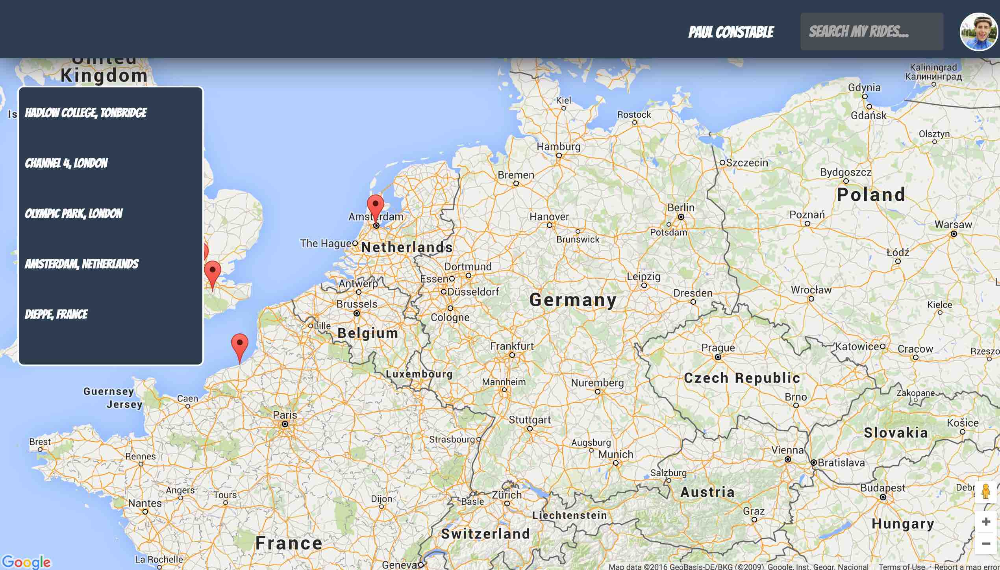

# neighbourhood-map-project

<h1>Neighbourhood Map Project: My Favourite Rides</h1>

To run this project, please visit: <a href="http://paulgconstable.github.io/dist/" target="_blank">http://paulgconstable.github.io/dist/</a> in any browser! Alternatively, please download the files and go to the 'dist' folder directory

<h3>Project Preview</h3>

Using Google Maps API in combination with Strava's API I have pulled in my favourite cycle rides and put them on the map for your perusal

<h3>My Favourite Rides included on the Map</h3>

<ol>
<li>Hadlow College, Tonbridge;</li>
<li>Channel 4, London;</li>
<li>Olympic Park, London;</li>
<li>Amsterdam, Netherlands;</li>
<li>Dieppe, France;</li>
</ol>

<i><b>Note:</b> The above rides are the start point locations of my favourite rides</i>

<h3>The Strava API provides:</h3>

<ol>
<li>The Cycle Distance;</li>
<li>The Average Speed;</li>
<li>The rough moving time;</li>
<li>The data for the polyline on the map.</li>
</ol>

<h3>Google Maps API provides:</h3>

<ol>
<li>The map;</li>
<li>Markers;</li>
<li>Info Windows;</li>
<li>Polyline to map the ride</li>
</ol>

The AJAX call to Strava's retrives my data from my favourite ride and then displays it on the map using the info window, polylines and markers.

<h3>Search Functionality</h3>

In the top right hand corner you'll note a search functionality with the placeholder text "Search My Rides". This will filter through the names of the map markers (the names of my favourite rides, noted above). Once filtered, you will then need to either tap or click on the name of the ride in the left hand menu to show the data from your input.

<h3>Bibliography</h3>

<ul>
<li><a href="https://strava.github.io/api/" target="_blank">Strava API</a></li>
<li><a href="https://developers.google.com/maps/" target="_blank">Google Maps API</a></li>
<li><a href="http://pdwhomeautomation.blogspot.co.uk/2016/03/strava-api-lap-analysis-using-raspberry.html" target="_blank">Paul's Geek Dad Blog - using Strava API as JSON</a></li>
<li><a href="https://hendrikbulens.wordpress.com/2015/08/03/c-and-the-strava-web-api/" target="_blank">Blog on using Strava data</a></li>
<li><a href="http://stackoverflow.com/questions/19730040/strava-v3-api-js-get-data" target="_blank">Stack Overflow on using Strava Data</a></li>
<li><a href="http://knockoutjs.com/index.html" target="_blank">Knockout Documentation</a></li>
</ul>

